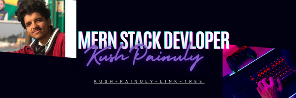

    
  

  
  ###
  
  

    
    
    
  

  
  ###
  
  

    
  

  
  ###
  
  <h1 align="center">Hi 👋, I'm Kush Painuly</h1>
  
  ###
  
  <h3 align="left">👩‍💻  About Me</h3>
  
  ###
  
  
A passionate MERN Stack Developer in India  -🌱 I’m currently learning **Advanced Full Stack development with MERN**  - 💬 Ask me about **Frontend, backend and database.**  - 📫 How to reach me **kushpainuly180@gmail.com**  - 📄 Know about my experiences: Six months of development experience as a full stack developer with a Chandigrah based company, DevB Infotech  - ⚡ Fun fact **I am an Artist**

  
  ###
  
  <h3 align="left">🛠 Language and tools</h3>
  
  ###
  
  

    
    
    
    
    
    
    
    
    
    
    
    
    
    
    
    
    
    
    
    
    
    
    
    
    
    
    
    
    
    
    
    
    
  

  
  ###
  
  <h3 align="left">🔥   My Stats :</h3>
  
  ###
  
  

    
    
  

  
  ###
